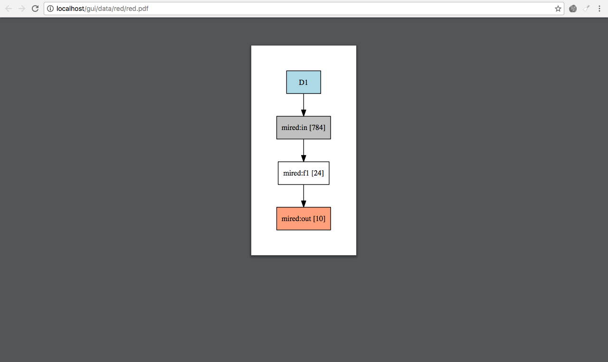
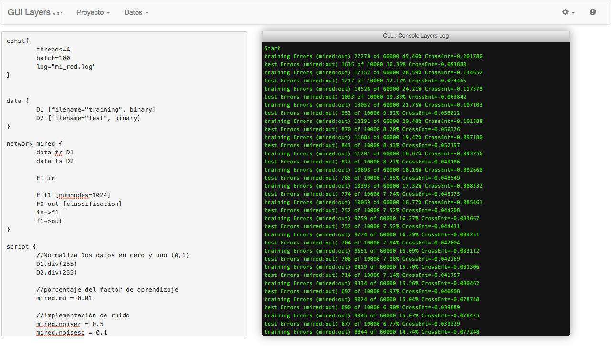

<b>GUI V 0.1 for Layers</b>
 
This is an interface to modify the values of neural networks elaborated in the toolkit <a href="https://github.com/RParedesPalacios/Layers" target="_new">Layers</a> for neural networks

 
<b>List of files generated in execution time of the neural network in layers</b>

 
<b>Digrama of a neural network in layers</b>

 
<b>CLL: Console Layers Logs</b>

